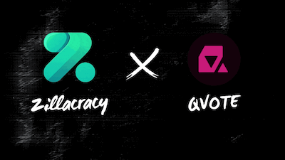

# QVoteZilliqaSDK :sunglasses: :nail_care:
### [Join our discord!](https://discord.gg/AWt6k9XhpT)

Quadratic Voting smart contract SDK for Zilliqa

Part of the [Zillacracy grant initiative](https://medium.com/zillacracy/2021-here-we-come-january-2021-zillacracy-blog-55552a4bd556).



# [Docs Here](https://qvote.github.io/ZilliqaQVoteSDK/index.html)

# Quadratic Voting - very oversimplified

Quadratic Voting is a better way of voting. It allows you to express more than simply your favourite choice. You are given a number of credits you can distribute to the options according to how you feel about them. You can also give negative credits to the options you don't like. The effective number of votes you cast for a given amount of credits is the square root of the absolute number of credits. This encourages you to vote for multiple options instead of piling all your credits on one choice. In this way you effectively get to rank the options according to your preference, and also express the extent to which you like or dislike an option.

There's actually much more to quadratic voting. Read up about it here.
https://vitalik.ca/general/2019/12/07/quadratic.html
https://www.radicalxchange.org/concepts/quadratic-voting/

# The basics

This sdk is designed to help build applications that use quadratic voting. It's functionality handles [these](https://github.com/QVote/ZilliqaContracts) smart contracts for you at a high level. Low level blockchain interactions are abstracted away.

## Install

Make sure you have [Zilliqa-js](https://github.com/Zilliqa/Zilliqa-JavaScript-Library) installed like so
`npm i @zilliqa-js/zilliqa`

Then install the QVote Zilliqa SDK
`npm i @qvote/zilliqa-sdk`

## Example walkthrough with Injected Zilliqa

```typescript
const TESTNET = {
  url: "https://dev-api.zilliqa.com",
  protocol: { chainId: 333, msgVersion: 1 },
};
const zil = new Zilliqa(TESTNET.url);
zil.wallet.setDefault(deployerAddress);
const qv = new QVoteZilliqa(zil, TESTNET.protocol);

/**
 * Get current block number (think of it as a timestamp)
 * Get current minimum gasPrice (price you pay for computation on the blockchain)
 */
const txblock = await zil.blockchain.getLatestTxBlock();
const curBlockNumber = parseInt(txblock.result!.header!.BlockNum);

/* Deploy a contract */
const [qvotingAddress, qvInstance, deployTx] = await qv.deploy(
  {
    name: "Test hi",
    description: "Hello hi",
    options: ["opt1", "opt2", "opt3", "opt4"],
    creditToTokenRatio: "1000",
    //can register for next 0 min
    registrationEndTime: qv.futureTxBlockNumber(curBlockNumber, 60 * 0),
    //can vote in 0 min and voting is open for 15 min
    expirationBlock: qv.futureTxBlockNumber(curBlockNumber, 60 * 15),
    tokenId: "DogeCoinZilToken",
  },
  deployerAddress
);

/* Register addressses */
const registerTx = await qv.ownerRegister(qvInstance, {
  addresses: [deployerAddress, voterAddress],
  creditsForAddresses: [100, 100],
});

/* Vote as deployer (we registered this qvotingAddress) */
const voteTx1 = await qv.vote(qvInstance, {
  // ["opt1", "opt2", "opt3", "opt4"] so we are giving
  // 20 cred to opt1, and -80 to opt2 0 to opt3, 0 to opt4
  creditsToOption: ["20", "-80", "0", "0"],
});

/* Vote as voter (we registered this qvotingAddress) */
zil.wallet.setDefault(voterAddress);
const voteTx2 = await qv.vote(qvInstance, {
  creditsToOption: ["50", "-30", "-20", "0"],
});

/**
 * Getting contract immutable initial state variables
 * Getting contract mutable state variables
 */
const contractState = await qv.getContractState(qvotingAddress);

/**
 * Adding qv contract qvotingAddress to a queue
 */

/**
 * Deploying queue
 */
zil.wallet.setDefault(deployerAddress);
const queue = new QueueZilliqa(zil, BLOCKCHAINS.CURRENT.protocol);

const [address1, queueInstance, deployTx1] = await queue.deploy(
  {
    maxQueueSize: "3",
  },
  deployerAddress
);

/**
 * we can also get the instance from a deployed address
 */
const regeneratedQueueInstance = queue.getInstance(address1);

/**
 * Pushing address to queue
 */
const pushTx = await queue.push(regeneratedQueueInstance, {
  addressToPush: qvotingAddress,
});

/**
 * Pushing address to queue2
 */
const pushTx2 = await queue.push(regeneratedQueueInstance, {
  addressToPush: voterAddress,
});
/**
 * Getting queue state
 */
const queueState = await queue.getContractState(address1, 14);
```

## Example walkthrough

Create the QVote object. With this we can pretty much do everything. Fetch, deploy, interact with the quadratic voting smart contracts.

Get the transaction block, the current blocknumber and the gas price. We will need these to deploy the contracts.

```typescript
const txblock = await zil.blockchain.getLatestTxBlock();
const curBlockNumber = parseInt(txblock.result!.header!.BlockNum);
const gasPrice = await qv.handleMinGas(zil.blockchain.getMinimumGasPrice());
```

### Deploy a QVote election

Create the payload with qvote and create a new contract instance, then deploy it with QVote.

```typescript
zil.wallet.setDefault(deployerAddress);
const contract = zil.contracts.new(
  ...qv.payloadQv({
    payload: {
      name: "Test hi",
      description: "Hello hi",
      options: ["opt1", "opt2", "opt3", "opt4"],
      creditToTokenRatio: "1000",
      //can register for next 0 min
      registrationEndTime: qv.futureTxBlockNumber(curBlockNumber, 60 * 0),
      //can vote in 0 min and voting is open for 15 min
      expirationBlock: qv.futureTxBlockNumber(curBlockNumber, 60 * 15),
      tokenId: "DogeCoinZilToken",
    },
    ownerAddress: deployerAddress,
  })
);
const [qvotingAddress, instance, deployTx] = await qv.handleDeploy(
  contract.deploy(...qv.payloadDeploy({ gasPrice }))
);
console.log(qvotingAddress);
```

### Registering and voting

To vote on a QVote smart contract you have to first register (prevents double voting). You pass to the payload a list of addresses that will be allowed to vote, and the number of credits they have.
NOTE: this is a temporary solution. As you can see, the owner can set the credits of every voter, so effectively control the election in a very centralized manner. The credit values should be proportional to the balances of tokens for each of the users (as explained in the smart contracts). As soon as we are able to access the state of another smart contract form within scilla, users will be able to register themselves and the smart contracts will take care of credit assigning.

```typescript
const registerTx = await instance.call(
  ...qv.payloadOwnerRegister({
    payload: {
      addresses: [deployerAddress, voterAddress],
      creditsForAddresses: [100, 100],
    },
    gasPrice,
  })
);
printEvents(registerTx);
```

some example votes

```typescript
const voteTx1 = await instance.call(
  ...qv.payloadVote({
    payload: {
      // ["opt1", "opt2", "opt3", "opt4"] so we are giving
      // 20 cred to opt1, and -80 to opt2 0 to opt3, 0 to opt4
      creditsToOption: ["20", "-80", "0", "0"],
    },
    gasPrice,
  })
);
printEvents(voteTx1);

/* Vote as voter (we registered this qvotingAddress) */
zil.wallet.setDefault(voterAddress);
const voteTx2 = await instance.call(
  ...qv.payloadVote({
    payload: {
      creditsToOption: ["50", "-30", "-20", "0"],
    },
    gasPrice,
  })
);
printEvents(voteTx2);

/**
 * Getting contract immutable initial state variables
 * Getting contract mutable state variables
 */
const init = await instance.getInit();
const state = await instance.getState();
const contractState = qv.parseInitAndState(init, state);
console.log(contractState);
```

### Decision Queue

There is another contract called `DecisionQueue`. This contract stores the addresses to deployed decision contracts so that they can be found in the blockchain by web apps. No databases, everything is onchain.
Pushing to this queue is optional. You can always share the address to the deployed decision contract 'manually' to all your users.
You can also deploy your own queue, for your own community. This way you can reference this queue in your web app, and display the decisions relevant to your community.

```typescript
/**
 * Deploying queue
 */
zil.wallet.setDefault(deployerAddress);
const queue = new QueueZilliqa();

const queueContract = zil.contracts.new(
  ...queue.payloadQueue({
    payload: {
      maxQueueSize: "3",
    },
    ownerAddress: deployerAddress,
  })
);
const [address1, queueInstance, deployTx1] = await queue.handleDeploy(
  queueContract.deploy(...queue.payloadDeploy({ gasPrice }))
);

/**
 * Pushing address to queue
 */
const pushTx = await queueInstance.call(
  ...queue.payloadPushQueue({
    payload: {
      addressToPush: qvotingAddress,
    },
    gasPrice,
  })
);
printEvents(pushTx);

/**
 * Pushing address to queue2
 */
await queueInstance.call(
  ...queue.payloadPushQueue({
    payload: {
      addressToPush: voterAddress,
    },
    gasPrice,
  })
);

/**
 * Pushing address to queue3
 */
await queueInstance.call(
  ...queue.payloadPushQueue({
    payload: {
      addressToPush: deployerAddress,
    },
    gasPrice,
  })
);

/**
 * Pushing address to queue4
 */
await queueInstance.call(
  ...queue.payloadPushQueue({
    payload: {
      addressToPush: zil.wallet.create(),
    },
    gasPrice,
  })
);

/**
 * Getting queue state
 */
const queueState = await queueInstance.getState();
console.log(queueState);
```
